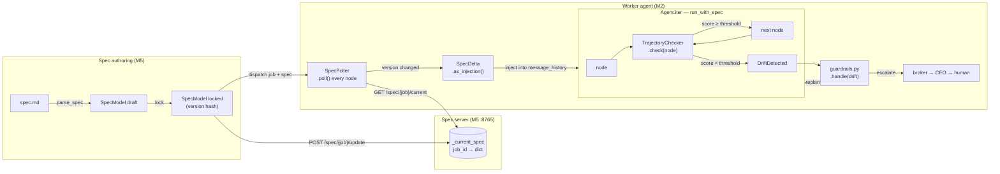

# ballast

A spec-verification kernel for long-running multi-agent systems.

**The problem:** agents drift from original intent mid-execution with no visibility into why or when. You restart the job. ballast makes restarting unnecessary.

**The approach:** lock intent before execution starts. Verify every agent action against that locked spec at every node boundary. Surface drift as typed observable events. Inject live spec updates between nodes without stopping the run.

---

## Architecture

ballast runs across two machines. The orchestrator (M5) holds the spec server and dispatches jobs. The worker (M2) runs agents locally, polls for spec changes, and verifies itself.

```
M5 (Orchestrator)                    M2 (Worker)
─────────────────                    ───────────
spec.md                              pydantic-ai Agent
    │                                    │
    ▼                                    ▼
parse_spec()                         run_with_spec()
    │                                    │
    ▼                                    ├── node 0 ── TrajectoryChecker ── score ✓
lock()  ──── dispatch job+spec ──►   ├── node 1 ── TrajectoryChecker ── score ✓
    │                                    ├── node 2 ── TrajectoryChecker ── DriftDetected
    ▼                                    │                                       │
spec server (:8765)                  guardrails.py ◄─────────────────────────────┘
    ▲                                    │
    │ POST /spec/{job}/update            ▼
developer edits spec.md          CorrectionContext
                                         │
    ┌────────────────────────────────────┘
    │  SpecPoller.poll() at every node
    │  SpecDelta.as_injection() → message_history
    └──► agent reads delta, adjusts, continues under same locked spec
```

### Runtime data flow



---

## How it works

### 1. Lock the spec before anything runs

Write a `spec.md`. Call `parse_spec()` + `lock()`. The locked `SpecModel` carries a stable version hash derived from intent + success criteria. No agent touches a task without a locked spec attached.

```python
from ballast.core.spec import parse_spec, lock

spec = lock(parse_spec("spec.md"))
# spec.version = "a3f2b1c9"  — stable, deterministic
# spec.locked_at = "2026-03-31T..."
```

### 2. Run the agent through `run_with_spec`

`trajectory.py` wraps `Agent.iter`. At every node boundary it scores three dimensions:

| Dimension | Method | How |
|-----------|--------|-----|
| Tool compliance | `score_tool_compliance` | Rule-based — is tool in `allowed_tools`? |
| Constraint violation | `score_constraint_violation` | LLM judge |
| Intent alignment | `score_intent_alignment` | LLM judge |

Aggregate score = `min(tool, constraint, intent)`. If score < `spec.drift_threshold` → `DriftDetected` is raised with full context.

### 3. Inject live spec updates between nodes

While the agent runs on M2, you can update the spec on M5:

```python
# M5 side — push an updated spec mid-run
httpx.post("http://m5:8765/spec/job-001/update", json=spec_v2.model_dump())
```

`SpecPoller.poll()` detects the version change at the next node boundary, computes a `SpecDelta`, and injects it into the agent's `message_history` as plain text:

```
[SPEC UPDATE a3f2b1c9 → 7d4e2f01]
NEW CONSTRAINTS (apply immediately): do not mention OpenAI or Anthropic
[Continue from current node under updated spec.]
```

The agent reads this as context and adjusts. The spec version hash in the audit log changes at exactly the node where the injection fired.

### 4. Drift escalation

When `guardrails.py` receives a `DriftDetected`:

```
DriftResult (score, failing_dimension, node_type, spec_version)
    │
    ├── first offence + mild drift → replan within spec
    │
    ├── replan produces same drift (loop detected) → escalate to broker
    │
    ├── broker can't resolve → escalate to CEO
    │
    └── CEO can't resolve → surface to human dashboard → timeout → CEO decides
         │
         └── CorrectionContext travels back to waiting agent
             (spec_version unchanged — agent resumes against same locked spec)
```

The spec never changes during escalation. `CorrectionContext` only changes what the agent does next.

---

## The spec format

```markdown
# spec v1

## intent
One sentence. What the agent is trying to achieve.

## success criteria
- criterion 1
- criterion 2

## constraints
- what the agent must never do

## escalation threshold
drift confidence floor: 0.4
timeout before CEO decides: 300 seconds

## tools allowed
- tool_name
```

---

## Project layout

```
ballast/
├── core/
│   ├── spec.py          — SpecModel, SpecDelta, parse_spec, lock, diff
│   ├── trajectory.py    — Agent.iter hook, DriftResult, run_with_spec
│   ├── server.py        — FastAPI spec server (M5 side)
│   ├── sync.py          — SpecPoller client (M2 side)
│   ├── memory.py        — per-run outcome storage, domain thresholds
│   └── stream.py        — AgentStream ABC
├── adapters/
│   ├── agui.py          — AG-UI protocol adapter
│   └── tinyfish.py      — lightweight streaming adapter
scripts/
├── server.py            — uvicorn entrypoint: python scripts/server.py
└── observe.py           — live observation script (in progress)
tests/
├── test_spec.py         — SpecModel, parse_spec, lock, SpecDelta, diff()
├── test_trajectory.py   — drift detection + scoring
├── test_sync.py         — FastAPI spec server + SpecPoller (mocked HTTP)
├── test_memory.py
└── test_stream.py
spec.md                  — sample spec (word count task)
```

---

## Setup

```bash
git clone <repo>
cd ballast
python -m venv venv && source venv/bin/activate
pip install -e ".[dev]"

cp .env.example .env
# add ANTHROPIC_API_KEY to .env

# run all tests (skip LLM integration tests; ~90 unit tests)
pytest tests/ -m "not integration"

# run the spec server
python scripts/server.py
```

---

## Build status

| Component | Status | Notes |
|-----------|--------|-------|
| `spec.py` — parse, lock, diff, inject | done | `SpecModel`, `SpecDelta`, `as_injection()` |
| `trajectory.py` — node scoring | done | tool/constraint/intent, escalation, probe, OTel |
| `server.py` + `sync.py` — live updates | done | FastAPI + `SpecPoller`; optional `BALLAST_SPEC_SERVER_TOKEN` on POST |
| `guardrails.py` — corrections + resume | done | `build_correction`, `HardInterrupt`, `can_resume` |
| `cost.py` — hard spend cap | done | per-agent + global hard stop (`HARD_CAP_USD`) |
| `dashboard.py` — Textual TUI | done | live `ballast-progress.json` |
| `adapters/otel.py` — typed spans | done | `emit_drift_span` for drift / violations |
| `adapters/smolagents.py` — M2 workers | planned | worker adapter for non–pydantic-ai runtimes |

---

## Architectural invariants

These must never be broken:

1. **Spec locks before any agent executes.** No agent touches a task without a locked `SpecModel` attached.
2. **Spec version travels with every job.** M5 dispatches job + spec version to M2. M2 verifies against that exact version.
3. **Drift detection runs at every node.** `trajectory.py` hooks into `Agent.iter` — not just at task completion.
4. **Escalation never drops context.** Full node history + spec version + drift score travels with every escalation.
5. **Cost cap enforced in code.** Never a config option. Always a hard stop.
6. **`spec_violation` is a typed OTel span.** Every drift event is observable, attributable, and cost-tagged.
